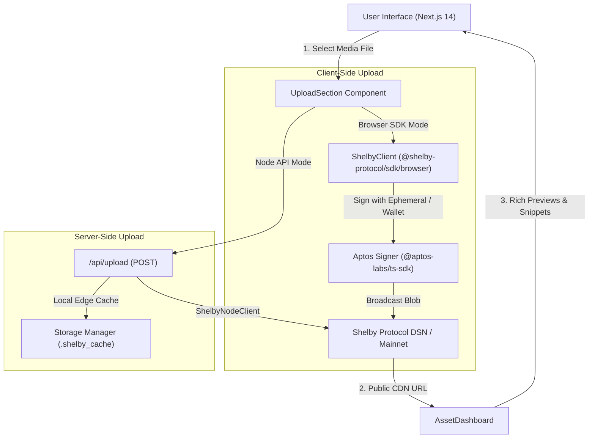

# Shelby CDN Explorer ⚡

A high-performance decentralized media storage explorer and edge CDN portal built on **Next.js 14 (App Router)**, **TypeScript**, **Tailwind CSS**, **Framer Motion**, and the official **Shelby Protocol SDK** (`@shelby-protocol/sdk`) with **Aptos** (`@aptos-labs/ts-sdk`).

---

## 🌟 Overview

**Shelby CDN Explorer** allows developers and content creators to seamlessly upload media assets (Images, Videos, PDFs) directly to the **Shelby Decentralized Storage Network (DSN)** on Aptos, instantly obtaining shareable public CDN URLs, real-time latency metrics, interactive previews, and copy-paste developer integration code snippets.

---

## 🚀 Key Features

- 📤 **Drag & Drop Upload Zone**: Seamless drag-and-drop interface with client-side MIME type verification and 50MB file size checks.
- ⚡ **Dual Upload Modes**:
  - **Browser SDK (Direct)**: Fast direct client-to-network upload signed via Aptos ephemeral signers or connected Web3 wallets.
  - **Node API Route (Secure)**: Secure server-side processing via `/api/upload` utilizing `ShelbyNodeClient` to keep private keys and API credentials protected.
- 🖼️ **Rich Media Previews**:
  - High-resolution image viewer with full-screen lightbox modal.
  - HTML5 video player for MP4/WebM formats.
  - PDF document viewer and download portal.
- 🌐 **Instant CDN & Proxy Delivery**:
  - Direct public Shelby RPC blob endpoints.
  - High-availability edge proxy routes (`/api/blob` and `/api/cdn/[...blobPath]`) for instant testing.
- 👛 **Aptos Wallet Integration**:
  - Support for **Petra**, **Pontem**, and browser standard AIP-62 wallets.
  - Real on-chain APT balance query from Aptos fullnode RPC.
  - Built-in **Sandbox / Ephemeral Signer** mode for instant zero-setup testing.
- 📊 **Performance & Storage Metadata**:
  - Live latency breakdown: ArrayBuffer read, signer generation, upload latency, and total duration.
  - 30-day mainnet expiration tracking, blob names, signer addresses, and transaction hashes.
- 💻 **Developer Code Snippet Generator**:
  - Auto-generated integration snippets for **React / Next.js**, **Node.js Server**, **Aptos SDK**, and **cURL**.
- 🔍 **Manual Blob Lookup & History**:
  - Query existing network blobs by name with real edge verification.
  - Local history tracking the last 10 session uploads.

---

## 🏗️ Architecture



---

## 📦 Getting Started

### Prerequisites

- **Node.js**: v18.17.0 or higher
- **npm** or **pnpm** / **yarn**

### Installation

1. Clone your fork of the repository:
   ```bash
   git clone https://github.com/maadan-dev/shely-cdn-explorer.git
   cd shely-cdn-explorer
   ```

2. Install dependencies:
   ```bash
   npm install
   ```

3. Configure environment variables (optional):
   ```bash
   cp .env.example .env.local
   ```

4. Run the development server:
   ```bash
   npm run dev
   ```

5. Open [http://localhost:3000](http://localhost:3000) in your browser.

---

## ⚙️ Environment Variables

Create a `.env.local` file in the project root to customize network endpoints and credentials:

```env
# Shelby Protocol Configuration
NEXT_PUBLIC_SHELBY_NETWORK=mainnet
NEXT_PUBLIC_SHELBY_API_KEY=anonymous
NEXT_PUBLIC_SHELBY_PUBLIC_BASE_URL=https://api.mainnet.shelby.xyz

# Server-Side Secure API Key (Kept safe on server, never exposed to client)
SHELBY_SECRET_API_KEY=your_private_api_key_here
```

---

## 🛠️ Scripts

- `npm run dev`: Starts the Next.js development server.
- `npm run build`: Compiles TypeScript and creates optimized production build.
- `npm run start`: Runs the built production server.
- `npm run lint`: Runs ESLint checks across the codebase.

---

## 💻 Developer Integration Examples

### React / Next.js Client
```typescript
import { ShelbyClient } from '@shelby-protocol/sdk/browser';
import { Network } from '@aptos-labs/ts-sdk';

const shelby = new ShelbyClient({
  network: Network.MAINNET,
  apiKey: process.env.NEXT_PUBLIC_SHELBY_API_KEY || 'anonymous',
});

export async function loadAsset(accountAddress: string, blobName: string) {
  const blob = await shelby.download({
    account: accountAddress,
    blobName: blobName,
  });
  return blob;
}
```

### Node.js Backend Route
```typescript
import { ShelbyNodeClient } from '@shelby-protocol/sdk/node';
import { Network, AccountAddress } from '@aptos-labs/ts-sdk';

const client = new ShelbyNodeClient({
  network: Network.MAINNET,
  apiKey: process.env.SHELBY_SECRET_API_KEY,
});

export async function fetchBlob(accountAddress: string, blobName: string) {
  const stream = await client.download({
    account: AccountAddress.from(accountAddress),
    blobName: blobName,
  });
  return stream;
}
```

### cURL
```bash
curl -X GET "https://api.mainnet.shelby.xyz/shelby/v1/blobs/<SIGNER_ADDRESS>/<BLOB_NAME>" \
  -H "Accept: image/png" \
  -o "asset.png"
```

---

## 🔒 Security Best Practices

1. **Private Key Protection**: Client-side uploads utilize session-scoped ephemeral signers generated in memory. Private keys are never logged or exposed via `NEXT_PUBLIC_` environment variables.
2. **Path Traversal Protection**: Local cache routes strictly validate and normalize relative file boundaries to prevent directory traversal attacks.
3. **MIME Sanitization**: Upload payloads undergo MIME-type filtering and strict filename sanitization to prevent malicious file uploads.

---

## 📄 License

MIT License. Built for the decentralized web on **Shelby Protocol** & **Aptos**.
